# Hum — Screenshots

Captured against current `main` via headless Chromium against a live `uvicorn` serving `frontend/dist/` + real YouTube data.

> Display font (Instrument Serif) was network-blocked in the capture sandbox; system serif fallback renders headings. In a real browser the **content** headings (track titles, brand wordmark, Welcome) use Instrument Serif while **chrome** (Search/Queue/Settings/Help/Confirm) uses SF Pro Display — that scope discipline was tightened in the post-critique sweep.

## Core flows

### Setup gate
First-run screen. Glass card, gradient brand mark, editorial italic logotype, saturated blue CTA.

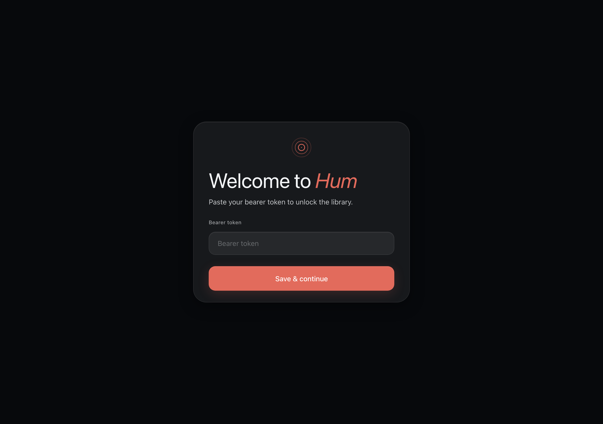

### App shell — Discover (empty state)
Sticky underline-on-active nav (replaced the earlier pill), "Discover" hero in **SF Pro Display** (chrome), frosted pill search input, italic empty-state hint in serif (editorial).

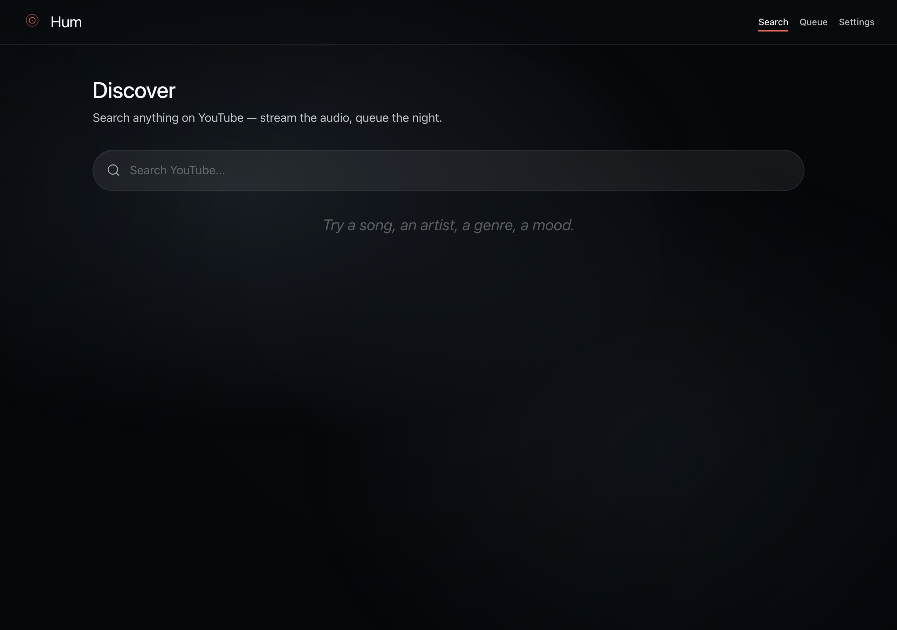

### Search results
Query echoes in editorial italic; results render as glass rows with Lucide search icon, thumbnails, and duration. Search-as-you-type fires after 350 ms debounce; Enter submits immediately.

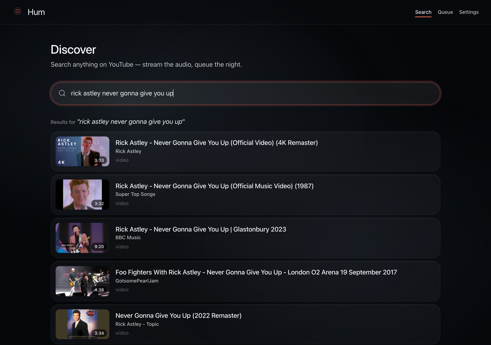

### Video detail
Hero artwork tile with shadow + inset highlight, large display-serif title (content gets the serif), upgraded `--t-lg` tabular-nums byline with full-ink semibold author. Three glass action buttons: Play now / Play next / Add to queue.

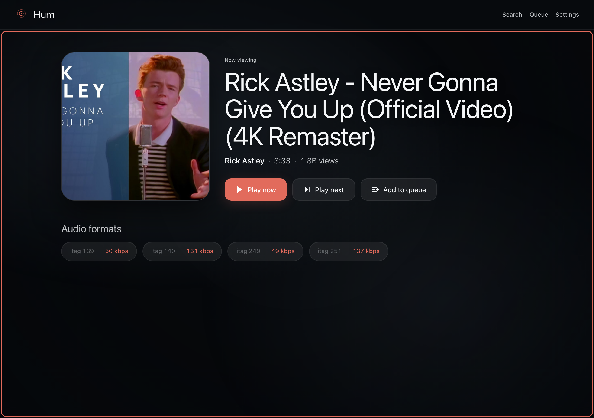

### Player active — chromatic artwork backdrop ⭐
**The signature treatment.** When a track plays, the dominant pixel of the artwork is sampled into `--art-hue` and the entire glass token system shifts toward that hue. The `.art-layer` blur was tuned down (60 px / saturate 220 % / no brightness multiplier) so the colour actually blooms instead of muting to grey. Wash is now a soft radial vignette, not a flat scrim. Mini-player title uses a CSS marquee for long names.

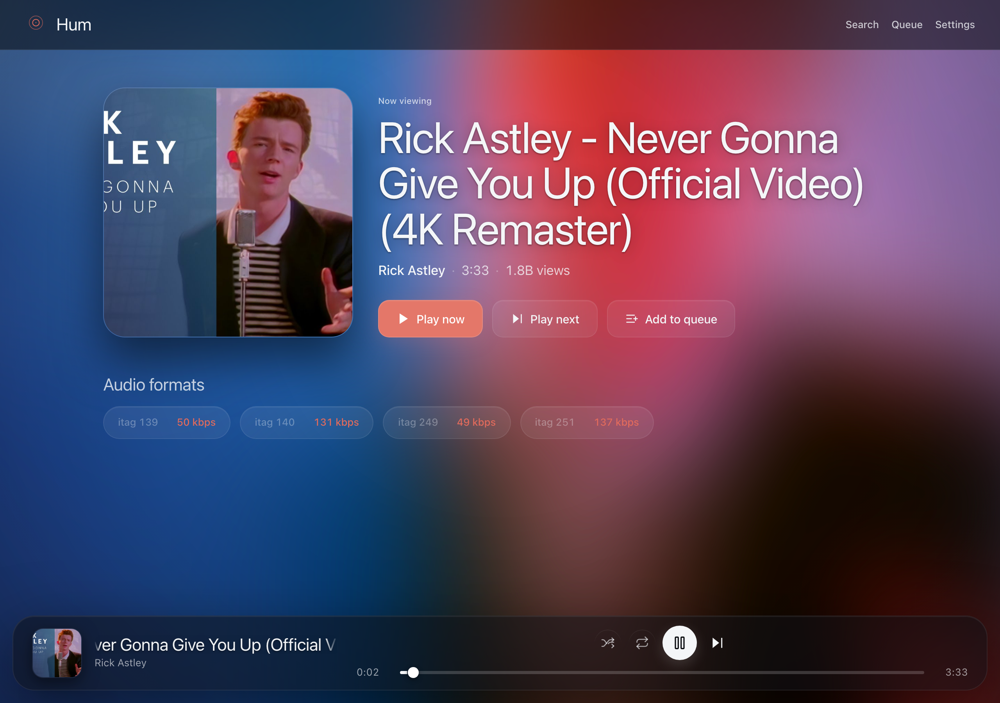

### Queue
**Now-playing card** promoted to a real hero: `--glass-4` surface, 80 px art, hairline-bold border, accent-coloured "NOW PLAYING" eyebrow, display-serif title. **Queued rows** visually inset below — track-number column removed, grip-vertical icon on the right signals drag, X on far right for remove. Up/down reorder buttons cut as redundant with DnD.

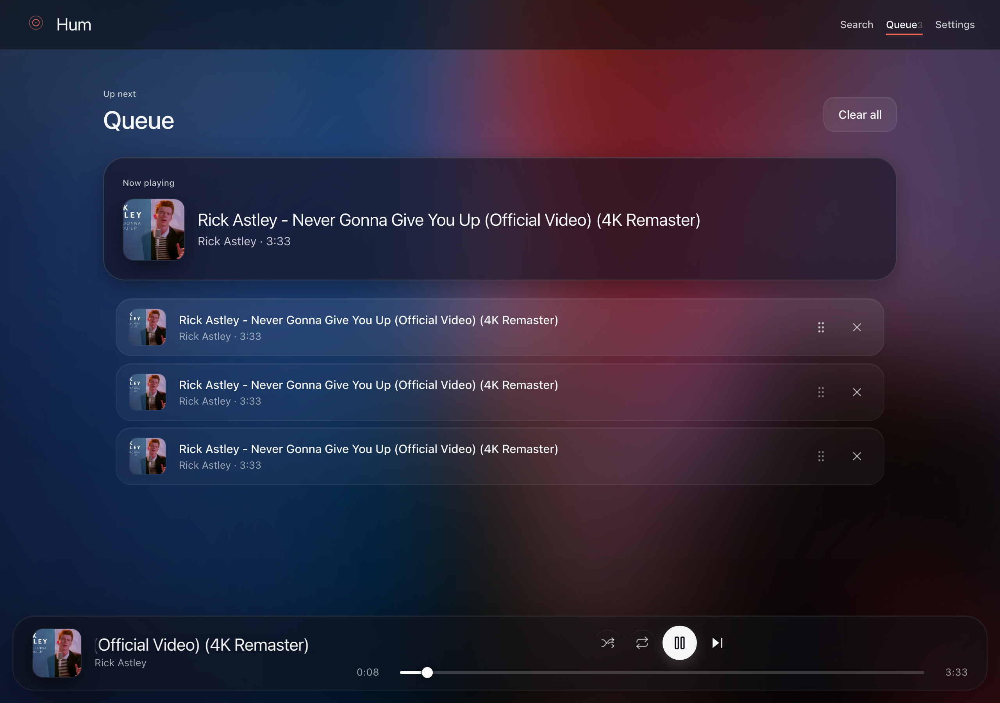

### Settings
Glass panel with eyebrow caps + SF Pro Display title (was serif — demoted). Auth + Queue actions; About line moved to small footer at the bottom. Destructive actions surface a native `<dialog>` confirm (see scene 9).

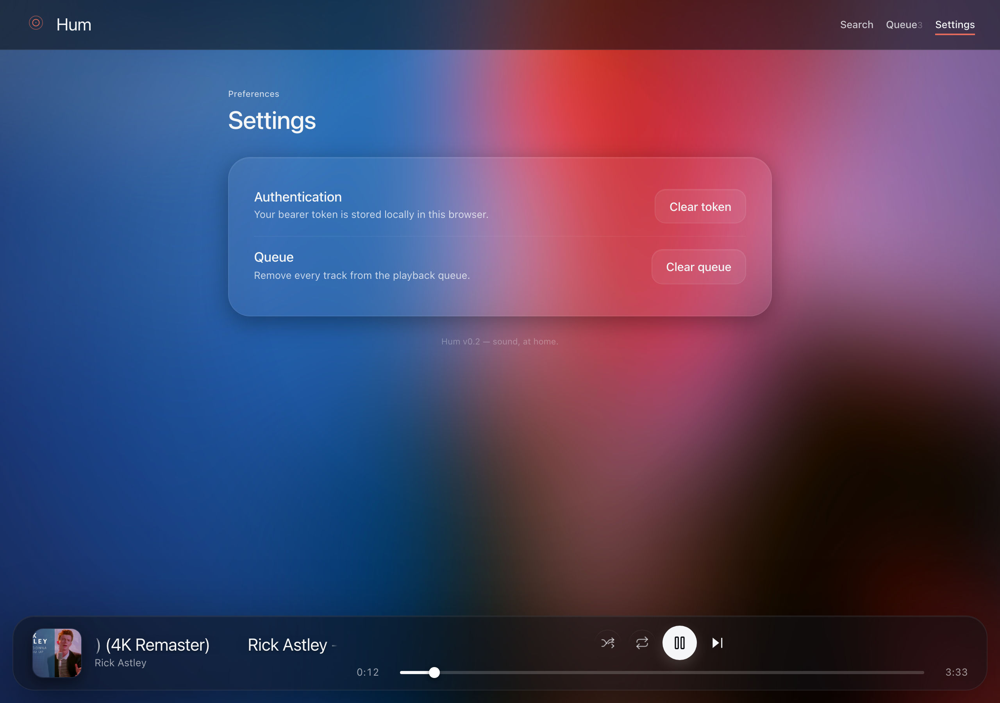

## Polish flows

### Keyboard shortcut help overlay
Press `?` to toggle. Title now SF Pro Display semibold (was Instrument Serif — chrome shouldn't be editorial).

| Key | Action |
|---|---|
| `Space` / `K` | Play / pause |
| `←` / `→` | Seek ±5 s |
| `Shift` + `←` / `→` | Seek ±30 s |
| `J` / `L` | Seek ±10 s |
| `N` | Next track |
| `M` | Mute / unmute |
| `/` | Focus search bar |
| `?` | Toggle help |
| `Esc` | Close help / collapse player |

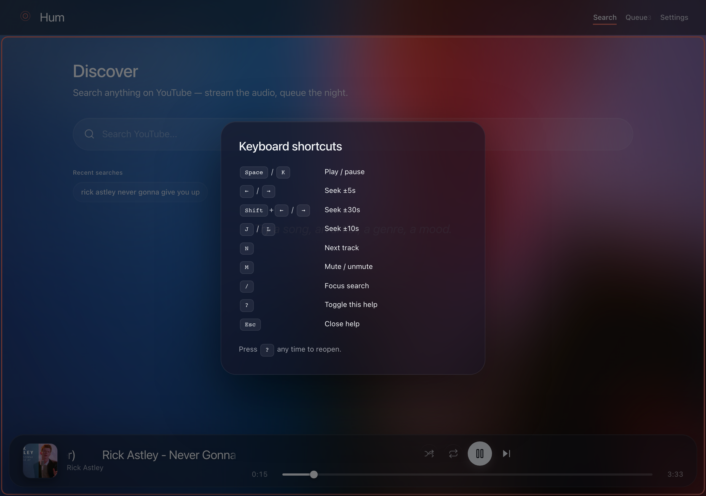

### Confirm dialog
Native `<dialog showModal()>`. Destructive button uses **Apple system red `#FF3B30`** (was Tailwind salmon `#ff6b6b` — replaced). Backdrop blur 40 px + saturate 180 % matches the help overlay treatment.

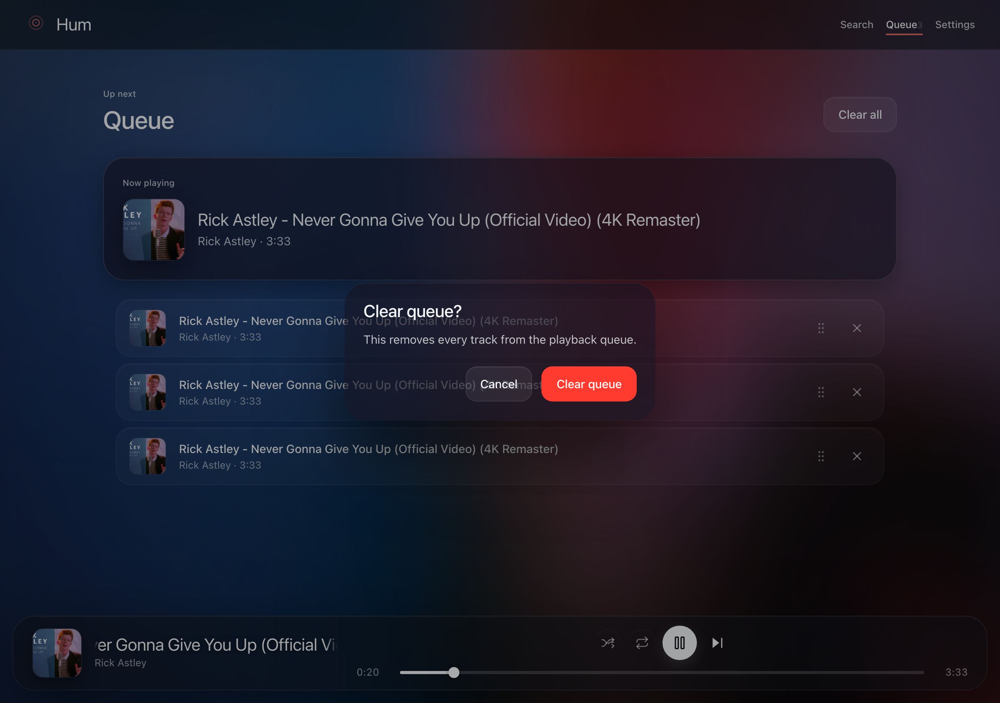

### Now Playing expanded ⭐ (new)
Click the mini-player art → grows into a **full-bleed view** via the View Transitions API (Chrome/Edge/Safari; Firefox snaps). 480 px art with inset highlight + drop shadow, display-serif title at `clamp(28px, 5vw, 52px)`, scrubber, large transport row, chevron-down close. Chrome (nav + mini-player) hides while expanded so this reads as a true full-bleed experience, not a card stacked on top.

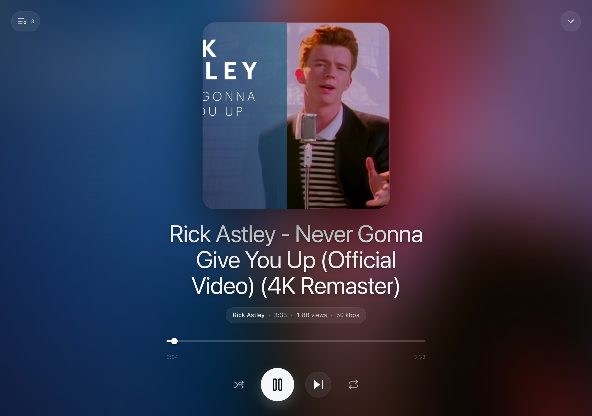

## Mobile (390×844, iPhone 14)

### Queue with bottom tab bar
On `(max-width: 720px)` the top nav repositions to the bottom as a glass tab bar — the mobile-native idiom the critique flagged as missing. Brand hidden, route links fill width with subtle pill highlight on active. Player capsule lifts above the tab bar.

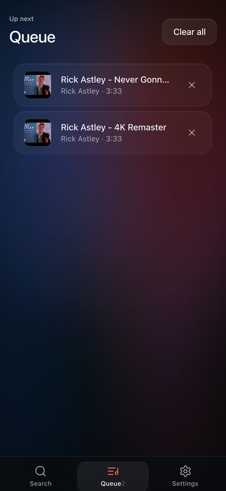

### Mobile Now Playing
Full-bleed glass overlay, art scaled to 70 vw, marquee title, transport row sized down. Tab bar hidden while expanded.

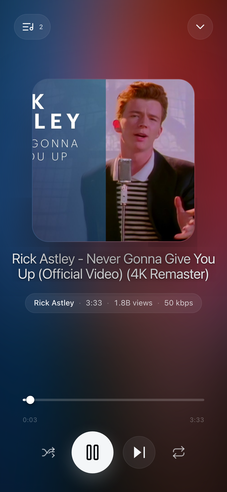

## How to regenerate

```bash
# 1. Build frontend + boot backend serving dist/
./scripts/build.sh
source .venv/bin/activate
uvicorn app.main:app --host 127.0.0.1 --port 8000 &

# 2. Install playwright once, write a bearer (matches API_BEARER_TOKEN in .env)
mkdir -p /tmp/hum-driver && cd /tmp/hum-driver
npm init -y >/dev/null && npm i playwright >/dev/null
npx playwright install chromium
echo "$API_BEARER_TOKEN" > /tmp/hum-bearer.txt

# 3. Run the driver — captures all 12 scenes in ~90s including real-YouTube fetches.
#    Writes PNGs to /tmp/hum-shots/.
node "$(git rev-parse --show-toplevel)/scripts/screenshots/shoot.mjs"

# 4. Copy results
cp /tmp/hum-shots/*.png "$(git rev-parse --show-toplevel)/docs/screenshots/"
```

> **Note**: Scenes 3-12 fetch live YouTube data through the Innertube backend.
> If YouTube rate-limits the source IP, those scenes will capture only the
> loading spinner. Scenes 1, 2, 7, 8 don't need live data and capture cleanly
> regardless. Bearer file path and output dir are configurable at the top of
> [shoot.mjs](../../scripts/screenshots/shoot.mjs).
